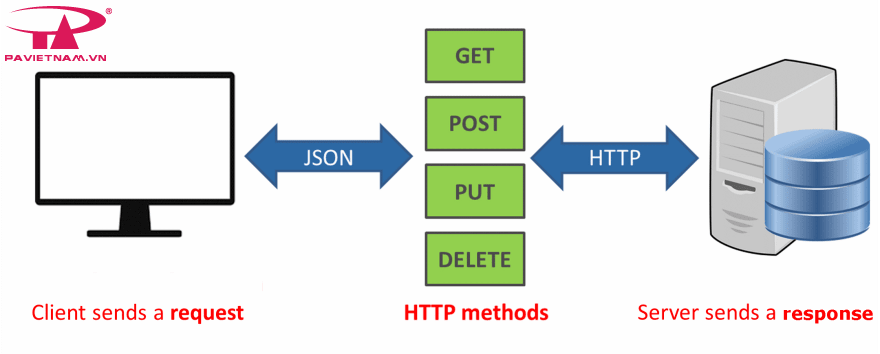
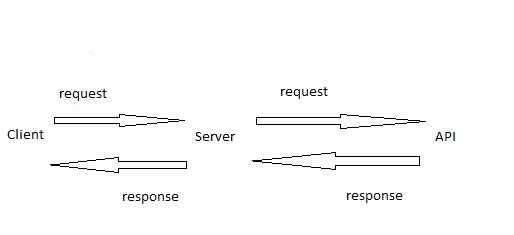
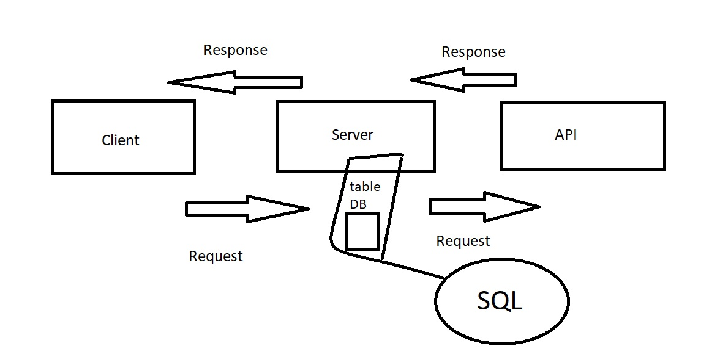
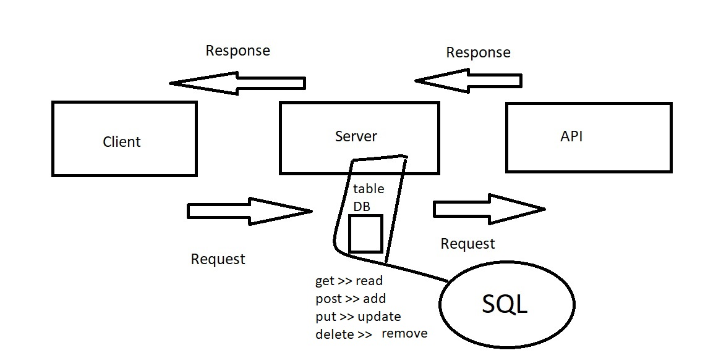

# Project Name - Project Version

Movies-Library

**Author Name**: Ala Emad

## WRRC

## Overview

A movie app that can check the latest movies based on categories.

## Getting Started

. Create a repository
. npm init -y
. Create a new branch.
. Create file (server.js, .gitignore, .eslintrc.json ).
. Install packages for this task: npm install express,cors.
. Create a routes using get.
. Create a constructor function to ensure your data follow the same format.
. Create a function to handle the server error (status 500).
. Create a function to handle "page not found error" (status 404).
. Add Documentation in your README file.

## request-response cycle

## new-response cycle

## new-response cycle lab16

## Project Features

check the latest movies based on categories suggestions.

Pages>>

. /trending
. /favorite
. /search
. /upcoming
. /latest
. /addMovie
. /getMovies
. /UPDATE/:id
. /DELETE/:id
. /getMovie/:id
